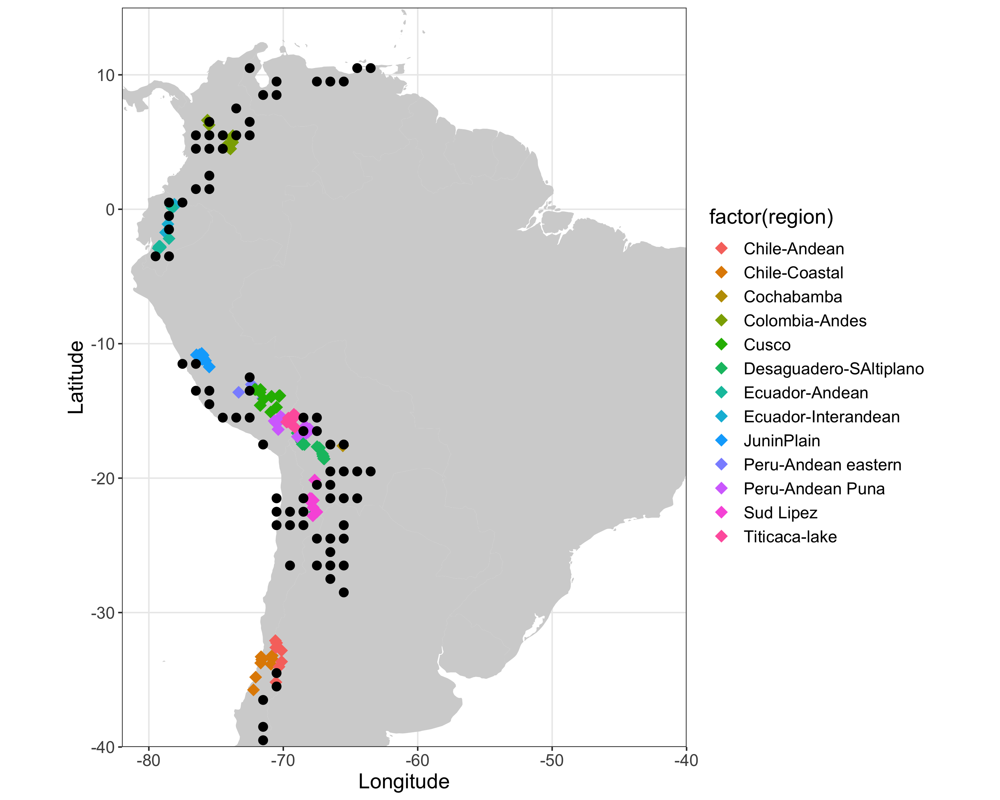
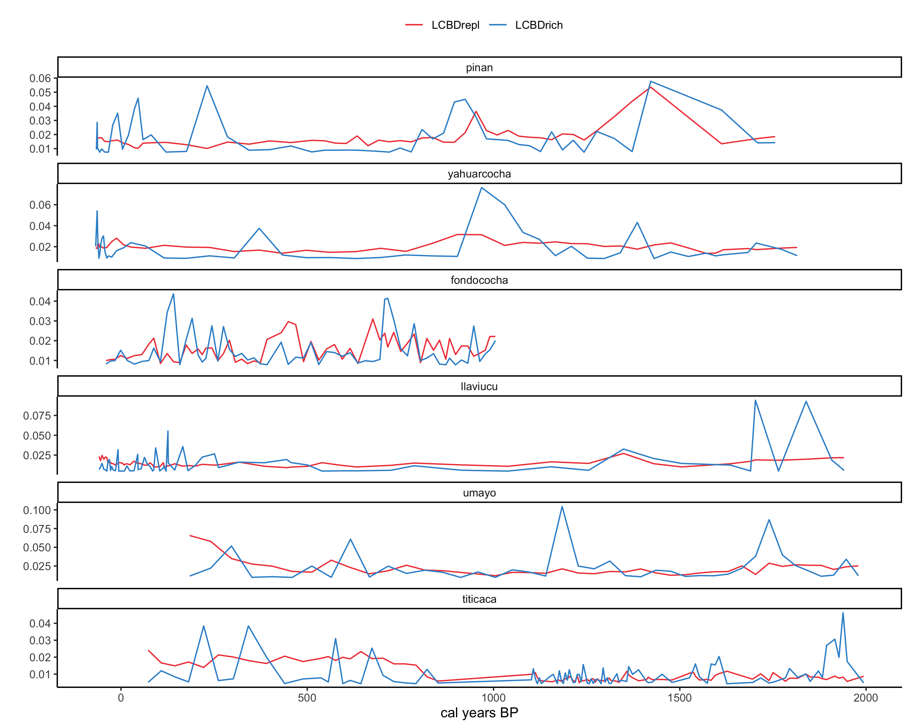

```{r setup, include=FALSE}
knitr::opts_chunk$set(include = TRUE)
library(magrittr)
library(kableExtra)
library(knitr)
```

# Frontiers in Ecology and Evolution (Metacommunity spatio-temporal dynamics special issue)

Special issue goal: to publish a set of innovative papers on metacommunity spatio-temporal dynamics to better understand how the factors and processes that structure metacommunities change across space and time, as well as the implications of such dynamics for biodiversity conservation and management [(link)](https://www.frontiersin.org/research-topics/11574/metacommunity-spatio-temporal-dynamics-conservation-and-management-implications#overview)

# Ecological uniqueness of South American diatoms across space and time
**Authors: Xavier Benito, Annika Vilmi, Melina Feitl, Marja Lindholm**

# Abstract
Despite their role in ecosystem function and structure, microorganisms have been largely neglected from metacommunity and conservation studies. This could be because the sparse geographic coverage of long-term biological monitoring data that limits our capacity to understand patterns and processes of microbial aquatic metacommunities and hence the quest whether or not freshwaters at the regional scale hold highly diverse communities for the identification of keystone sites and their use as sentinels of environmental change over time. To fill this gap, we use a tropical South American diatom (unicellular siliceous algae) database to quantify drivers of spatial and temporal beta diversity and derive implications for regional biodiversity. Specifically, we ask how spatial beta diversity patterns can fingerprint the ecological uniqueness of lake communities and environmental variation over time. This question is being addressed by decomposing beta diversity in species richness and replacement and the contributions of sites (time) to these components (LCBDrich and LCBDrepl) across 187 lakes and through time by analyzing paleolimnological assemblages. For spatial beta diversity patterns, we used multiple datasets that characterize in-lake and macroscale environmental gradients, including water chemistry, climate, geology, topography, land-use and historical human footprint. We tested the effect of the explanatory variables on each LCBD indices using Generalized Additive Models. We accounted for spatial autocorrelation by including smooth splines of geographical coordinates, and including region as a random factor. For temporal trends in spatial beta diversity, we analyzed LCBD time series from a set of 6 sedimentary diatom assemblages spanning the last 2000 years to examine potential mechanisms of environmental change. GAM results indicated that LCBD varied as a result of water conductivity, pH, precipitation seasonality, and human footprint (as indicated by historical human density), whereas replacement and richness components of beta diversity were primarily driven by conductivity. As expected, the temporal trends of the relative contributions of richness and replacement fluctuated over millennial-time scales. Across lakes, richness fluctuated more than replacement, especially in the two Altiplano deep-water freshwater lakes Umayo and Lagunillas, where beta replacement increased since 500 cal yr BP. Replacement and richness were more similar across Ecuadorean Paramo lakes (Piñan and Fondococha) than lakes located at lower elevation (Yahuarcocha and Llaviucu), suggesting temporal stability. Our results indicate that spatial beta diversity of diatoms across the tropical Andes are jointly responding to distinct macroscale environmental gradients and water chemistry and, consequently, potential management actions should account for both local and regional environmental characteristics of the lakes. Decomposing temporal trends of beta diversity components seems particularly important for investigating trajectories of lacustrine diatom diversity under different system states, especially when LCBD replacement fingerprint richer-than-average assemblages. Partitioning beta diversity metrics has a strong potential to unify frameworks of diatom ecology and metacommunity theory to better understand mechanistic drivers of niche, stochastic, and historical processes. 

# Figures

```{r echo=FALSE, fig.cap="Distribution of lake sites. Black dots are 1km square spatial grids of geologicla variables extracted from Antonelli et al. 2018", out.width = '100%'}

```

```{r echo=FALSE, fig.cap="Effect of predictors on local contributions to beta diversity (LCBD) components, estimated as linear predictors from Generalized Additive Models", out.width = '100%'}
knitr::include_graphics("../figures/gamLCBD_modplot.png")
```

```{r echo=FALSE, fig.cap="Temporal trends of beta diversity components for the six investigated lake sedimentary sequences (arranged by increased latitude). LCBD=local contributions to beta diversity", out.width = '100%'}

```


