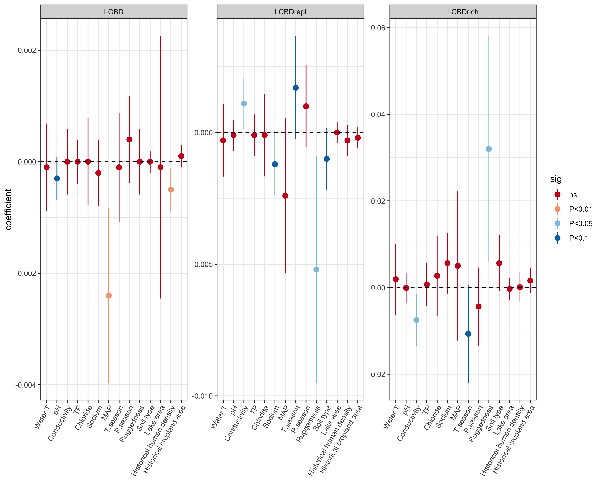

```{r setup, include=FALSE}
knitr::opts_chunk$set(include = TRUE)
library(magrittr)
library(kableExtra)
library(knitr)
```

# Frontiers in Ecology and Evolution (Metacommunity spatio-temporal dynamics special issue)

Special issue goal: to publish a set of innovative papers on metacommunity spatio-temporal dynamics to better understand how the factors and processes that structure metacommunities change across space and time, as well as the implications of such dynamics for biodiversity conservation and management [(link)](https://www.frontiersin.org/research-topics/11574/metacommunity-spatio-temporal-dynamics-conservation-and-management-implications#overview)

# Spatial and temporal ecological uniqueness of Andean diatom communities are correlated with climate, geodiversity and long-term limnological change
**Authors: Xavier Benito, Annika Vilmi, Melina Feitl, Marja Lindholm, Maria-Laura Carrevedo, Sherilyn C Fritz**

# Abstract
High-elevation tropical lakes are excellent sentinels of global change impacts, such as climate warming, land-use change, and atmospheric deposition. These factors are often correlated with temporal and spatial beta diversity patterns, with some local communities contributing more than others, a phenomenon known as local contribution to beta diversity (LCBD) or ecological uniqueness. Microorganisms, such as diatoms, are considered whole-ecosystem indicators but little is known how these characteristics play out in beta diversity studies, mostly because of the lack of large spatial and temporal datasets. To fill this gap, we used a tropical South American diatom database comprised of modern (144 lakes) and paleolimnological (6 sediment cores) observations to quantify drivers of spatial and temporal beta diversity and evaluate implications for environmental change and regional biodiversity. We used methods of beta diversity partitioning (replacement and richness) by determining contributions of local sites to these components (LCBDrepl and LCBDrich), and studied how they are related to environmental, geological, and historical variables using Generalized Additive Models. Beta replacement time series were also analyzed with GAM to test whether there is widespread biotic homogenization across the tropical Andes. Modern lake ecological uniqueness was jointly explained by limnological (pH), climatic (mean annual precipitation), and historical human impacts. Limnological (conductivity) and geodiversity variables (terrain ruggedness, soil variability) were inversely correlated to replacement and richness components of local contribution to beta diversity, suggesting that not all lakes contributing to regional diversity are targets for conservation actions. Over millennial time scales, decomposing temporal trends of beta diversity components showed different trajectories of lake diatom diversity as response of environmental change. This is exemplified with i) increased hydroclimatic variability (as inferred by decreased temperature seasonality) mediating higher contribution of richness to local beta diversity patterns ca. 1000 years ago in Ecuador Andean lakes; and ii) lake-specific decreased temporal beta diversity trends for the last ca. 200 years, indicating that biotic homogenization is not widespread across the tropical Andes. Our approach for unifying diatom ecology, metacommunity studies, and paleolimnology can facilitate the understanding of future responses of tropical Andean lakes to global change impacts.

# Figures

```{r echo=FALSE, fig.cap="a) Geographical location of the modern investigated lakes (n=144) colored by regions within the tropical Andes of South America (see Supplementary Table 1 for individual lakes information in each region); the location of the six lake cores are also shown with different symbols; b) Proportion of diatom ecological groups for each lake region. Samples represent sediment surface habitats", out.width = '100%'}

```

```{r echo=FALSE, fig.cap="Effect of predictors on local contributions to beta diversity (LCBD) and to the replacement (LCBDrepl) and richness (LCBDrich) components, estimated as linear coefficients from Generalized Additive Models. Errors bars are  95% confidence intervals. Colors indicate the significance level α = 0.05", out.width = '100%'}

```

```{r echo=FALSE, fig.cap="Contribution of replacement (LCBDrepl) and richness (LCBDrich) components to beta diversity for the six investigated lake cores (arranged by increased latitude). Isotopic δ18O measurements from Pumacocha lake (Bird et al., 2011) are interpreted as dry periods with enriched values", out.width = '100%'}

```

```{r echo=FALSE, fig.cap="Temporal trends of Hierarchical GAM-fitted beta replacement for the six Andean lakes investigated in this study (arranged by increased latitude). Model GS (green line) indicates a global curve and inter-lake variation having similar smoothness. Model GI (orange line) indicates a global curve allowing for varied smoothness among lakes"}


```


